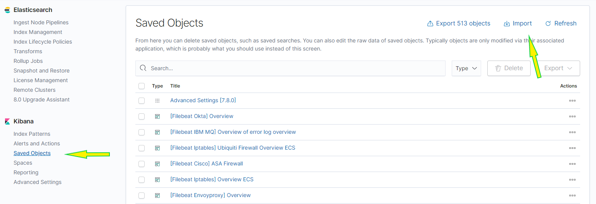
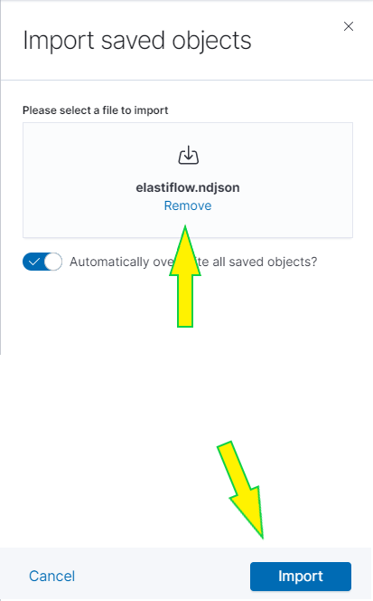
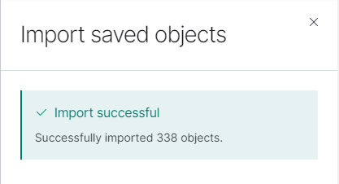

.. _setup-pensando-elk:

Setup
======================

The Elastiflow visualizations require that they are manually loaded.  To do this, in the Kibana UI:

1.) Click the "Hamburger Menu" button in the top left corner and under **Management** select "Stack Management"

.. image:: _static/stackmgmt.png
    :scale: 50 %

2.) Under the Kibana section, select the **Saved Objects** link and click **Import** in the upper right hand corner

That will bring up the import screen on the right side.

3.) Click the Import icon and select the file from your install directory located here:

.. code-block:: bash

    <install-dir>/pensando-elk/files/etc/elastiflow/elastiflow.ndjson

4.) Once the file is selected, click the blue Import button at the bottom of the page

If it works (*and why wouldn't it?*) you should see something similar to the below:

Now from the Dashboard menu you should be able to see the Elastiflow dashboards