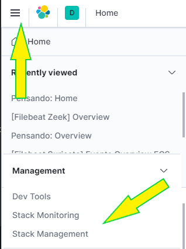

.. _setup-pensando-elk:

Setup
======================

The Elastiflow visualizations require that they are manually loaded.  To do this, in the Kibana UI,
click the "Hamburger Menu" button in the top left corner and under **Management** select "Stack Management"

